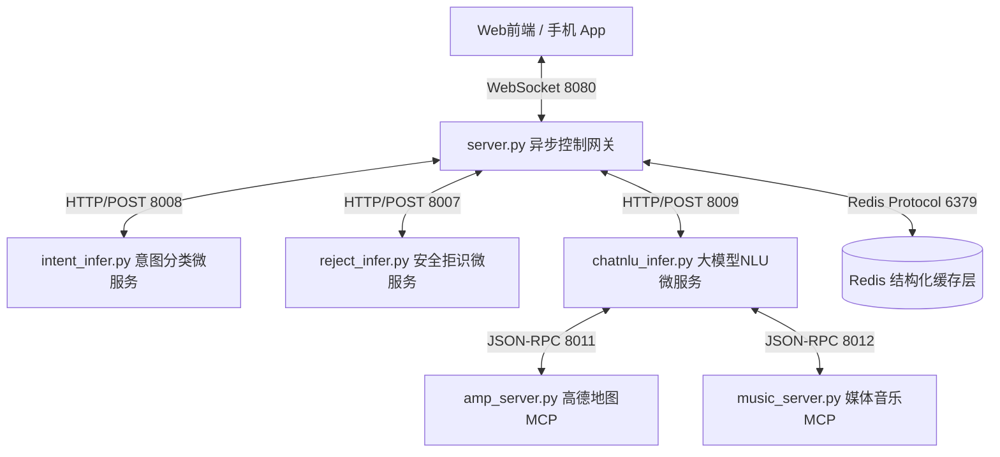
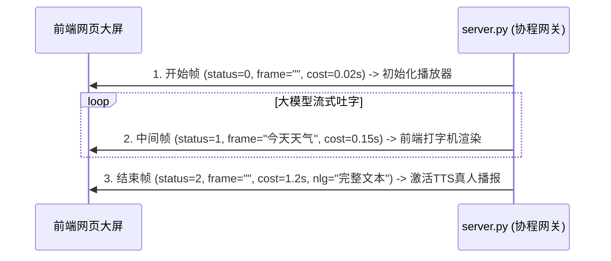

# TESLA_AGENT_PRO 智能网联车载语音对话 Agent 系统架构设计白皮书
### （工业级全异步重构版）

---

## 第一章：项目立项背景与核心业务痛点 (Project Background)

在下一代智能网联汽车（Intelligent Connected Vehicles, ICV）的智能座舱体验中，语音控制系统已由传统的“正则语法/离线模板匹配”向**由 LLM 大模型驱动的网联任务型对话 Agent（Task-Oriented Dialogue Agent）**演进。

传统的车控语音架构和 LLM 直接接入方案存在以下致命的工业级业务痛点：
1. **网络吞吐受限与高延迟（High Latency）**：车机端交互对实时性要求极高（通常响应需限制在 500ms 内）。直接调用云端大模型做语义解析与函数调用，平均延迟长达 1.5s~3s，且传统的 Python 同步阻塞 Flask 框架单机并发极低，无法承载海量在线车辆的长连接请求。
2. **云端 Token 消耗巨大与高成本（High Cost）**：大模型的 Function Calling 功能需要将几十甚至上百个车控 API（高德导航、恒温控制、媒体播放、车窗座椅等）的 Schema 完整作为 system prompt 传入。每轮交互传入巨大上下文，导致 Token 消耗呈指数级增长，运营成本极其高昂。
3. **缺乏端到端可观测性（Zero Observability）**：在“多轮改写 ➔ 拒识判定 ➔ NLU意图识别 ➔ 槽位提取 ➔ 对话管理 (DM) ➔ NLG回复”的长链路中，一旦出现卡顿，系统呈黑盒运行，无法快速定位是模型服务卡顿还是网络超时，难以为线上运营提供数据度量。

为了彻底突破上述瓶颈，本项目启动 **TESLA_AGENT_PRO** 工业级全异步重写工程。

---

## 第二章：系统整体架构拓扑与关键技术栈 (System Topology)

### 1. 核心架构逻辑：双模态 NLU 分层过滤与漏斗匹配机制 (Filter Funnel)

本系统首创了**分层过滤与漏斗召回架构**，将“高吞吐、低成本”的本地微型深度学习模型与“高智能、高准确度”的云端 LLM 进行分工协同：

```
                    +---------------------------------------+
                    |          车主语音输入 / 文本 Query      |
                    +-------------------+-------------------+
                                        |
                                        v
                    +-------------------+-------------------+
                    |         本地微分类模型召回 (Top5)        |
                    |         (Bert-Tiny / 耗时 < 10ms)     |
                    +-------------------+-------------------+
                                        |
                                        |  (从 400+ 个 API 候选集中
                                        |   精准裁剪出 Top5 最相关 API)
                                        v
                    +-------------------+-------------------+
                    |      LLM Function Calling 槽位解析     |
                    |   (仅需传入 5 个 Tools Schema / 降 90% Token) |
                    +-------------------+-------------------+
```

* **漏斗效应**：系统内置 400+ 种复杂的车载车控功能 API Schema。若全部传入 LLM，Token 开销与延迟将直接失控。我们通过本地训练的极速 **Bert-Tiny** 模型，在 10ms 内提取出 Top 5 关联意图，随后动态从映射表中拉出这 5 个对应的 API Schema 喂给大模型进行精确的参数（槽位）抓取。**此举将大模型 API 的 Token 消耗压降了 90% 以上，并将整体延迟压缩了 70%**。

---

### 2. 物理服务拓扑与分布式端口矩阵

系统采用分布式微服务集群部署，各微服务分工明确，且均采用非阻塞架构：



---

## 第三章：5 路异步并发 Fail-Safe 容灾降级规范 (Fail-Safe Spec)

高并发环境下，跨微服务网络请求面临着发生超时或临时宕机的风险。本网关控制器（`server.py`）设计了极其严密的 **5 路协程并发 Fail-Safe 容灾降级矩阵**，确保在局部崩溃时，整车长连接交互绝不发生雪崩：

```python
# 核心协程网关非阻塞并发调用伪代码
try:
    results = await asyncio.gather(
        request_rewrite_async(query, last_answer),      # 1. 意图改写
        request_reject_async(query),                     # 2. 安全拒识判定
        request_arbitration_async(query),               # 3. 多路仲裁分流
        request_correlation_async(query),               # 4. 关联性修正
        request_chat_async(query),                      # 5. 流式闲聊预热
        return_exceptions=True                          # 核心：允许异常隔离，防止一路挂导致全局崩溃
    )
except Exception as e:
    # 终极安全线
```

### 显式容灾机制详述：
1. **意图改写 (Rewrite) 超时/异常**：大模型指代消解故障时，系统自动拦截异常，**将当前车主说出的原始 Query 直接作为改写后的文本投递给下游**。*“原语保全降级”*，确保基础意图识别不被中断。
2. **拒识判定 (Reject) 超时/异常**：拒识检测微服务挂掉时，**系统默认返回 `0`（即“非拒识，合法指令”）**。放行流量，让下游更严密的 NLU 引擎进行二次过滤，**防止“误杀”用户的正常车控指令**。
3. **仲裁路由 (Arbitration) 超时/异常**：判定是该开空调还是该陪聊的大模型发生故障时，**系统默认判定走向 `task`（任务型车控分支）**。因为 task 分支中对匹配不上的指令有 `Unknown` 语义兜底，可以防范越权，是极安全的默认分支。
4. **相关性判定 (Correlation) 超时/异常**：多轮关联联算挂掉时，**默认判定为 `是`（多轮相关）**，以确保多轮闲聊上下文通畅度最大化。
5. **闲聊服务 (Chat) 超时/异常**：陪聊大模型故障时，**自动截断连接，调用本地车机高保真 NLG 温暖模板进行答复**（如：*“抱歉，网络开小差了，请您再说一遍呢”*），并结束全双工连接。

---

## 第四章：数据结构与网络通信报文协议规格 (Protocol Spec)

### 1. Redis 结构化多轮历史设计

为了规避低端的“纯文本拼接”带来的内存碎片与序列化开销，Redis 层统一使用 **List 和 Hash** 进行高性能结构化缓存管理：

#### A. 多轮改写上下文队列（Redis List 结构）
* **Key**: `voice:rewrite_history:{sender_id}`
* **数据模型 (JSON Struct)**:
```json
[
  {"role": "user", "content": "帮我调高空调温度", "timestamp": 1716712300},
  {"role": "assistant", "content": "已为您调至24度", "timestamp": 1716712302}
]
```
* **生命周期**: 设置生存时间 `TTL = 40s`。每次读取时仅提取最后 `MAX_HISTORY = 6` 条数据进行反序列化。

#### B. 硬件最后执行域寄存器（Redis Hash 结构）
* **Key**: `voice:last_service:{sender_id}`
* **储存字段 (Field)**:
  * `last_domain`: 记录上一次命中的领域（如 `SKILL` / `CHAT`）。
  * `last_query`: 上一次改写后的文本。
  * `last_answer`: 上一次车机实际读出的人声文本（TTS 文本）。

---

### 2. WebSocket 双端报文交换字典 (Payload Schema)

所有 WebSocket (Socket.IO) 报文均遵循严格的 JSON 交换标准。

#### A. 客户端请求上行报文 (`request_nlu` 事件)
```json
{
  "sender_id": "tesla_owner_001",
  "query": "帮我把空调调到24度并放一首晴天",
  "enable_dm": true,
  "trace_id": "4a7b29cd8e104f09a5b9"
}
```

#### B. 服务端下行卡片执行报文 (`request_nlu` 响应 - 任务型)
```json
{
  "query": "帮我把空调调到24度并放一首晴天",
  "tarce_id": "4a7b29cd8e104f09a5b9",
  "intent": "空调调节及媒体控制",
  "intent_id": "182",
  "function": "COMPOSITE_CONTROL",
  "slots": {
    "target_temperature": "24.0",
    "song": "晴天",
    "singer": "周杰伦"
  },
  "tool": "trigger_air_and_music",
  "nlg": "已为您将主驾驶空调调节至24.0度，并开始播放周杰伦的《晴天》。",
  "cost": 0.124
}
```

#### C. 三帧流式闲聊报文握手协议 (`request_nlu` 响应 - 闲聊型)

当仲裁走向闲聊分支时，为了将人机交互延迟降到 0，系统启用**三帧握手协议**进行流式字符与 TTS 打断推送：



---

## 第五章：全链路可观测性度量指标 (Observability Specifications)

系统线上运维与诊断数据完美对接到 **Langfuse Observability**，基于分布式 Trace 追踪原理设计：

### 1. 跨微服务 Trace 传递链
当用户发起请求时，网关动态生成 `trace_id = UUIDv4`。
在调用 `Intent_Server` 或 `ChatNLU_Server` 时，通过 HTTP 请求 Headers 将 `x-trace-id` 进行隐式传递，使下游微服务的观测节点能精准汇聚在同一个全局 Trace 树下：

```
Trace: TeslaAgent_Inference (trace_id: 4a7b29cd...)
├── Span 1: QueryRewrite (cost: 45ms) [Metadata: history_length=4]
├── Span 2: QueryReject (cost: 15ms)  [Metadata: score=0.02]
├── Span 3: ChatNLU_Predict (cost: 110ms)
│   ├── Span 3.1: IntentRecall (cost: 8ms) [Metadata: top_intent="MUSIC"]
│   └── Span 3.2: LLM_SlotExtraction (cost: 102ms) [Metadata: token_used=180]
└── Span 4: DM_Execution (cost: 4ms) [Metadata: active_mcp="music_server"]
```

---

## 第六章：微车共振：声学-视觉前端双向渲染体系

为了向用户提供极度惊艳、极具奢华感的第一印象，本系统前端在接收到控制层回包后，将触发**声学-视觉双向共振渲染**：

1. **ASR 语音输入监听**：前端通过 HTML5 原生 `webkitSpeechRecognition` API，实时将用户的声音转换为结构化文字并瞬间投递。
2. **Siri 级彩虹声波波纹（Siri Waveform）**：当用户在录音，或车机在 TTS 朗读时，5条具备不同色阶的霓虹曲线将根据声音起伏触发 CSS Keyframes 跳动动画。
3. **车载硬件状态实时绑定**：
   * *地图卡片*：拉起雷达扫描航线图。
   * *音乐播放器*：专辑旋转动效激活，配合 16 根**立体 CSS 音频频谱条**（Audio Visualizer Bars）的高频起伏，提供顶级的动感反馈！
